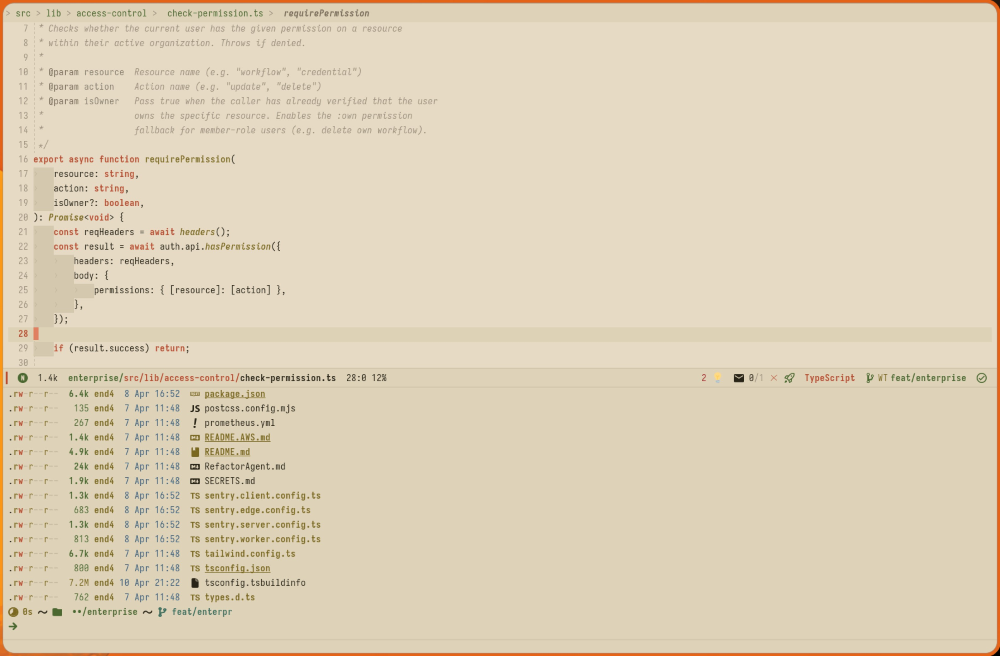

  

<h1 align="center">Ember</h1>

  <em>One vivid coral spark in a sea of warm graphite.</em>

  <a href="https://embertheme.com">embertheme.com</a> ·
  <a href="#palette">Palette</a> ·
  <a href="#philosophy">Philosophy</a> ·
  <a href="#ports">Ports</a> ·
  <a href="https://github.com/ember-theme/ember/blob/main/palette.json">palette.json</a>

---

  

## Philosophy

Most themes give you a rainbow. Ember gives you restraint.

The background is warm graphite (`#1c1b19`). Text is ivory (`#d8d0c0`). Every accent — olive greens, steel blues, dusty mauves — stays desaturated and quiet. Then coral (`#e08060`) lights up keywords, the cursor, the modeline bar, and search highlights.

**One ember in the ash.**

Eight muted accents sit in a narrow CIELAB L\*52–58 band, balanced to equal perceptual brightness. Then one vivid coral at S55% cuts through like a match struck in the dark. Your eyes know exactly where to look. Everything else recedes. Your code breathes.

| Metric | Value |
|--------|-------|
| Contrast ratio | 11.2:1 (body text) |
| Accessibility | WCAG AA |
| Variants | 3 (dark, soft, light) |
| Hue spread | Narrow (~90°), all warm |
| Saturation | Ultra-muted except coral hero |

### Design Rationale

Ember is hand-tuned in **CIELAB perceptual color space** — not generated from an HSL palette picker. CIELAB models how humans actually see color: if two colors differ by the same numeric amount in Lab, they *look* equally different. RGB and HSL don't have this property, which is why many themes have accents that unintentionally shout over others.

**Perceptual balance.** All eight accents are normalized to a flat L\*52–58 lightness band. No single color screams louder than the rest. The "squint test" holds: blur your eyes and every accent recedes equally — except coral.

**Monochrome hero strategy.** Where themes like Gruvbox give you seven vivid accents at similar saturation, Ember inverts the approach: seven *muted* earth tones plus one *vivid* coral (S67%). This creates a natural focal hierarchy — your eye goes straight to what matters.

**Warm graphite, not brown.** Ember lives close to Gruvbox's territory but at dramatically lower saturation. Background saturation stays at S6% — enough to feel warm, low enough to stay out of the way. The background is the ash, not the ember.

**Built for long sessions.** Body text sits at 11.2:1 contrast, well above WCAG AAA. Accents are tuned for WCAG AA. Foreground is warm ivory, never pure white — readable without eye strain over long sessions. Foreground is warm ivory, never pure white.

| | Gruvbox | Ember |
|---|---------|-------|
| Character | Retro, warm, vivid | Warm, minimal, focused |
| Hero accent | None (even saturation) | Coral (monochrome hero) |
| Accent count | 7 (all vivid) | 8 (1 vivid, 7 muted) |
| BG saturation | ~15% | ~6% |

## Three Flavors

| Variant | Background | Description |
|---------|-----------|-------------|
| **Ember** | `#1c1b19` | Dark graphite, L10% — the default |
| **Ember Soft** | `#242320` | Lifted graphite, L13% — softer contrast |
| **Ember Light** | `#e6dac4` | Warm ivory, L84% — darkened accents for contrast |

  
   
  <em>Ember Light — warm parchment, not clinical white.</em>

## Palette

| Color | Hex | Role |
|-------|-----|------|
|  **Coral** | `#e08060` | Hero accent — keywords, cursor, links |
|  **Orange** | `#c09058` | Constants, properties |
|  **Gold** | `#c8b468` | Functions, types |
|  **Olive** | `#8a9868` | Strings |
|  **Sage** | `#80a090` | Methods |
|  **Steel** | `#7890a0` | Muted blue |
|  **Rose** | `#b07878` | Dusty rose |
|  **Mauve** | `#988090` | Faint violet |

The full palette definition (all variants, hex/HSL) is available as [`palette.json`](palette.json) — the single source of truth for all ports.

## Ports

| Port | Repository | Status |
|------|------------|--------|
| **Emacs** (Doom) | [ember-theme/emacs](https://github.com/ember-theme/emacs) | :white_check_mark: Available |
| **Neovim** | [ember-theme/nvim](https://github.com/ember-theme/nvim) | :white_check_mark: Available |
| **Ghostty** | [ember-theme/ghostty](https://github.com/ember-theme/ghostty) | :white_check_mark: Available |

### Coming soon

| Port | Repository |
|------|------------|
| Kitty | [ember-theme/kitty](https://github.com/ember-theme/kitty) |
| VS Code | [ember-theme/vscode](https://github.com/ember-theme/vscode) |
| Zed | [ember-theme/zed](https://github.com/ember-theme/zed) |
| iTerm2 | [ember-theme/iterm](https://github.com/ember-theme/iterm) |
| Alacritty | [ember-theme/alacritty](https://github.com/ember-theme/alacritty) |
| WezTerm | [ember-theme/wezterm](https://github.com/ember-theme/wezterm) |
| IntelliJ | [ember-theme/intellij](https://github.com/ember-theme/intellij) |

Want to build a port? Use [`palette.json`](palette.json) as your source of truth and open an issue.

## License

MIT — Hossam Saraya
